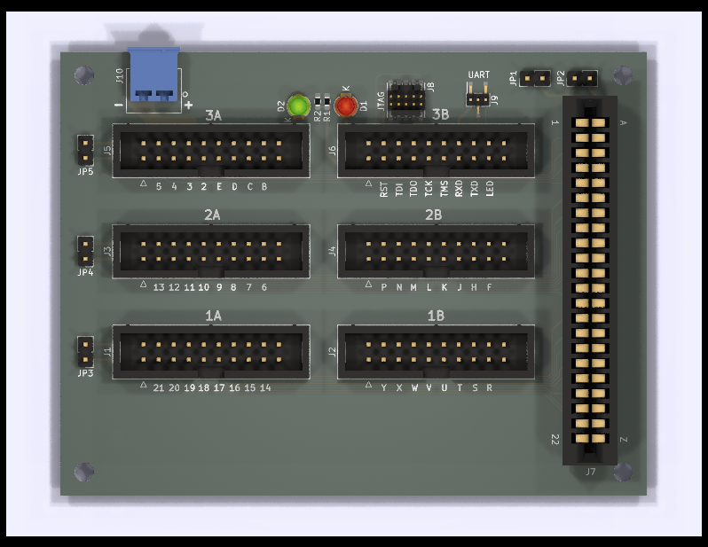

Cartridge Breakout
==================

This is a PCB to break out the signals of a 44-contact 2.54 mm card edge
connector, as used in cartridges for the C64, to pin headers.  It was
designed for use with the Orange Cartridge, but can be used with any C64
cartridge, or even other compatible card edge devices.

The board can be used for testing, debugging and prototyping cartridges
and FPGA cartridge gateware and software.

Features
--------

- 40 of the 44 contacts are routed to individual pins compatible
  with IDC or Dupont wiring.

- The 4 corner contacts are instead connected to a ground plane
  which is available on 40 pins, one for each signal pin.

- There is a 5V power plane which can be used to inject power into
  contacts 2 and 3, or just one of them if so desired.

- There is a 5-signal JTAG/SWD breakout from a 2x5 1.27 mm pin header,
  as a wired side channel to the cartridge.

- There is also a 2-signal UART breakout from a 1x3 1.27 mm pin header,
  likewise a wired side channel.

- There are two LEDs which can be controlled with a single pin, to support
  semi-automated testing setups.

Documentation
-------------

**[Building instructions](doc/Building.md)**  
**[User manual](doc/UserManual.md)**
