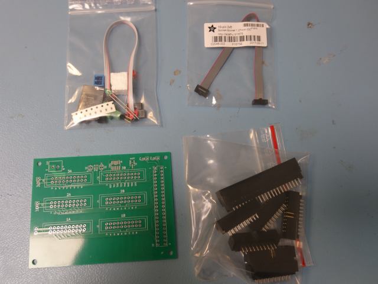
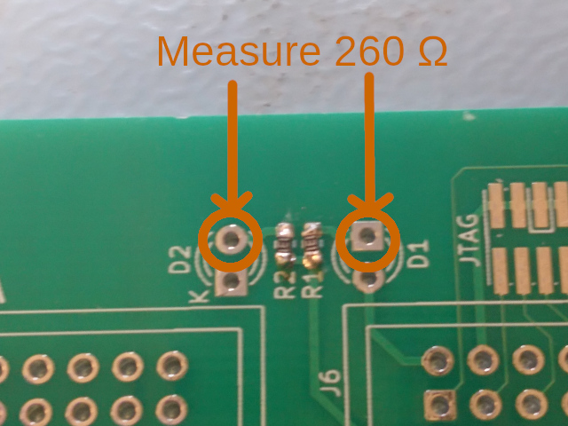
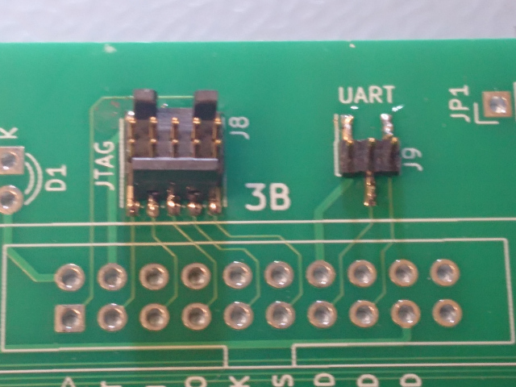
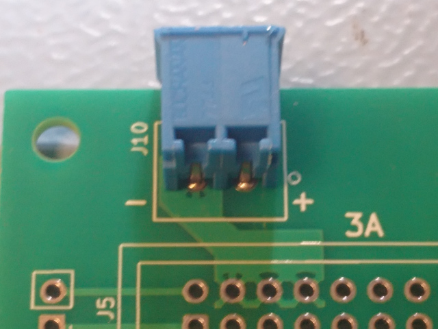
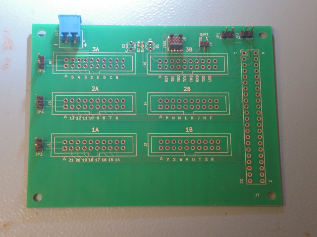
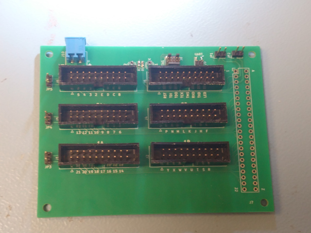
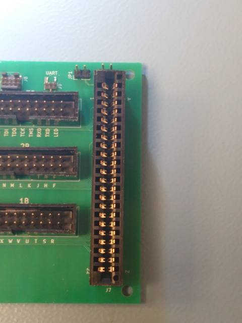
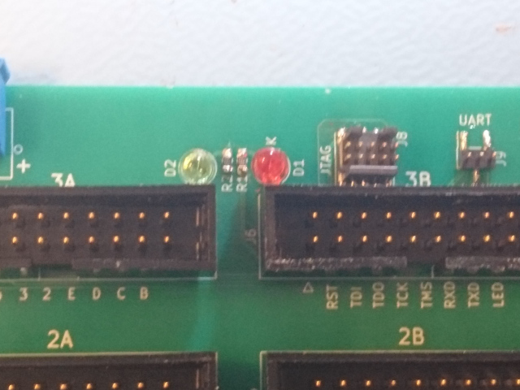

Building instructions
=====================

Preparation
-----------

The cartridge breakout takes about one hour to build.  Before
starting, check that you have everything of the following.

### Equipment required

* Soldering iron
* Tweezers, for manipulating the surface mount components
* Wire cutters, for adjusting the length of the LED pins
* Some solder

### PCB

* The printed circuit board to populate

### Large components

* 2x10 pin headers (6)
* 44 pin card edge connector

### Small components

* 130 ohm resistors, size 0603 (a bunch, in case you drop some
                                and never find them again :)
* 2x5 1.27 mm surface mount pin header for JTAG
* 1x3 1.27 mm surface mount pin header for UART
* Right angle 3.5 mm header for power
* 1x2 pin headers for jumpers (5)
* Red 3 mm LED
* Green 3 mm LED

### Accessories

* Pluggable screw terminals for power
* Jumpers
* 3-pin UART cable
* 10-pin JTAG cable

Surface mount components
------------------------

The first step is to mount the surface mount components.  These
components are all optional and not related to the core functionality
of cartridge pin breakout and power supply, but if you are ever going
to mount these components, now is the time to do it, when there is no
solder on the bottom of the board making it uneven, or any large
components (the 20 pin headers in particular) on the top side getting
in the way.  So even if you have no immediate plans for these
functions, I recommend at least giving it a try.  Each surface mount
component relates to one separate function (red LED, green LED, JTAG
side channel, UART side channel), so even if mounting one component
fails, it won't affect any other functionality on the board.

## Resistors

Mount two 130 ohm resistors as shown in the picture.  Use tweezers to
hold the resistors down when soldering, so that they do not get stuck
on the soldering iron.

When the resistors are correctly mounted, you should be able to
measure about 260 ohms of resistance between the indicated pads.
If you measure infinity (or more than 1k at least) ohms, there is
a bad solder joint.  If you measure 0 ohms, there is a short circuit.
If you measure 130 ohms, then either there is a short circuit or you
mounted the resistors rotated 90 degrees.  :-)

## Side channel pin headers

Next, mount the two surface mount pin headers for the side channels (JTAG
and UART).  Mind the orientation of the key slot on the 2x5 pin header.
Hold down each header with tweezers and solder one pin first, and then
after inspecting that all pins are correctly aligned solder the rest of
the pins, starting on the opposite side from the pin you soldered first.
Don't use too much solder.  You can use flux if you have it, but it's not
necessary.

Use an ohm meter to check the connections.  With the exception of
the ground pins (the leftmost pin on the UART connector, and the
4 top left pins on the UART connector), each pin should be connected to
exactly one pin on the lower row of 3B, and to none on the top row.
The ground pins should be connected to the middle 8 pins of the top
row of 3B.

Through hole connectors
-----------------------

After the surface mount components are in place, it's time to mount
all those through hole pin headers.  This is done starting with
the lowest header and ending with the highest, so that the workbench
can be used to keep the headers pushed against the PCB when soldering.

## Power header

These headers come with housings in both blue and green.  There is
no difference except for the actual color.  Mount it as shown in
the picture.

## Jumper headers

These can be a bit tricky to get completely vertical.  Solder one pin
first and check on the top side if there is a significant tilt before
soldering the other one.

## 2x10 pin headers

When soldering the 2x10 pin headers, be careful with the orientation
of the key slot in the shroud.  It should be pointing towards the bottom
of the board, as indicated by the silkscreen markings.

Solder two corner pins first and then double check the orientation on
the top side before soldering the rest.

If you start by inserting header 1A and 3B at the same time, flipping
the board over and soldering the corner pins, the PCB will have a stable
base to rest on, making soldering easier.

## Card edge connector

This connector has small markings indicating pin "1" and "43",
but is otherwise completely symmetrical, so just mount it in
either of the two possible orientations.

LEDs
----

Now the only thing left to mount is the LEDs.  If you did not mount
the resistors in the first step, don't mount the LEDs now.  They will
not work without the resistors, and if you should decide to mount the
resistors later it's better to mount the LEDs _after_ that.

When mounting the LEDs, make sure to observe the polarity, which
should be different on the two.  The shorter pin is the cathode and
goes into the hole marked "K".  Another way to check is that the side
of the dome which has a flat portion at the bottom should be facing
the side with the hole that has a square pad.

Don't trim the length of the pins until after you solder.  Just bend them
to keep the LED in place while soldering, and cut them afterwards.

