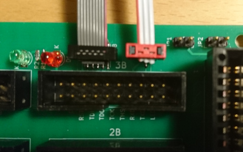

User Manual
===========

Cartridge connection
--------------------

The cartridge is inserted in connector J7, with the top side facing
inwards.  The silk screen indicates the positions of contact 1 and 22,
on the top side, and A and Z, on the bottom side.  When inserting a
board without a case guiding the position, mind the proper alignment
of the card edge contacts against those in the connector.

Cartridge signal break-outs
---------------------------

The 40 non-ground cartridge signals are available on the connectors
"1A", "1B", "2A", "2B", and "3A" (designation J1 through J5), 8 signals
in each connector.  Each connector also has 8 ground connections.

The pinout of each 20-pin connector is as follows:

For the mapping of the IO signals, please refer to the markings on the
silk screen, or to the tables at the end of this document.

All the IO pins are connected directly to the corresponding contact on
the cartridge, meaning that the signal levels are 5V.  For VOUT and VIN,
see next section.

Note that in the case of the Orange Cartridge, power must be applied
through the card edge connector for the IO signals to be active.  When
the cartridge is powered only through the USB port, the level shifters
are disabled preventing FPGA signals from reaching the card edge connector.

+5V power plane
---------------

C64 cartidges receive +5V power through contacts 2 and 3 on the card edge
connector.  While it is possible to feed power into these contacts using
the corresponding break-out pins on connector 3A, they can also be fed
from a separate power plane, by installing jumper JP1 and/or JP2.

| Jumper | Function when installed                       |
| ------ | --------------------------------------------- |
| JP1    | Contact 2 receives power from the power plane |
| JP2    | Contact 3 receives power from the power plane |

There is no back-current protection provided, so do not connect a
power supply to the break-outs for contact 2 or 3 when the
corresponding contact is powered from the power plane.  The break-out
pins can still be used to monitor the voltage, if desired.

Feeding the power plane from a +5V power supply can be done through the
pluggable screw terminal J10.  Observe the polarity as indicated on the
silk screen.

The 20-pin connectors 1A, 2A and 3A also provide an interface to the
power plane.  The VIN pins are always connected to the power plane,
and are intended for monitoring the voltage level.  The VOUT pins are
intended for feeding the power plane, and can be connected or
disconnected from the power plane using jumpers located next to the
connector.  Do not install these jumpers when feeding the power plane
through J10.

| Jumper | Function when installed                        |
| ------ | ---------------------------------------------- |
| JP3    | The power plane receives power from VOUT on 1A |
| JP4    | The power plane receives power from VOUT on 2A |
| JP5    | The power plane receives power from VOUT on 3A |

Side channel connector
----------------------

Connector "3B" (designation J6) is not connected to the card edge
connector.  Instead it provides break-outs for connector J8 and J9,
which can be connected to the cartridge (or other eqiupiment) using
cables.  These signals will typically use different voltage levels
from the signals on the card edge connector.  In the case of the
Orange Cartridge, all signals on this connector use 3.3V levels,
and are operational also when the cartridge is only powered through
the USB connector.

J8 is a 2x5 1.27 mm keyed pin header intended for connection to an
"SWD" style JTAG connector.  This carries the 4 mandatory JTAG signals
as well as a reset signal (typically SRST), all of which are broken
out on connector 3B.  Please refer to the silk screen markings or the
tables at the end of this document for the mapping.  The reference
voltage present in the SWD connector is routed to the VIN pin of 3B.

J9 is a 1x3 1.27 mm pin header intended for a debug UART.  Pin 1 is
connected to GND, and the other two are routed to 3B as "RXD" and "TXD".
Be careful with the orientation and alignment when inserting a cable into
J9, as there is no keying.

LEDS
----

There are two LEDs on the board intended for use with semi-automated
testing.  They are controlled by the LED pin (IO7) of connector 3B,
according to the following scheme:

| LED pin voltage relative to GND | Function           |
| ------------------------------- | ------------------ |
| Floating                        | Both LEDs off      |
| 0V                              | Red LED on         |
| +3.3V                           | Green LED on       |

There is no support for turning on both LEDs at the same time.  Note
that for the red LED to be operational, VOUT on 3B must be driven to
+3.3V relative to the common GND.

IO mapping tables
-----------------

The following are the pin mapping tables for the individual 20-pin
connectors.

### 1A

| Pin   | Signal                       |
| ----- | ---------------------------- |
| IO0   | 21 (D0)                      |
| IO1   | 20 (D1)                      |
| IO2   | 19 (D2)                      |
| IO3   | 18 (D3)                      |
| IO4   | 17 (D4)                      |
| IO5   | 16 (D5)                      |
| IO6   | 15 (D6)                      |
| IO7   | 14 (D7)                      |
| VIN   | Power plane sense            |
| VOUT  | Power plane feed through JP3 |

### 1B

| Pin   | Signal                       |
| ----- | ---------------------------- |
| IO0   | Y (A0)                       |
| IO1   | X (A1)                       |
| IO2   | W (A2)                       |
| IO3   | V (A3)                       |
| IO4   | U (A4)                       |
| IO5   | T (A5)                       |
| IO6   | S (A6)                       |
| IO7   | R (A7)                       |
| VIN   | No connection                |
| VOUT  | No connection                |

### 2A

| Pin   | Signal                       |
| ----- | ---------------------------- |
| IO0   | 13 (DMA)                     |
| IO1   | 12 (BA)                      |
| IO2   | 11 (_ROML)                   |
| IO3   | 10 (_IO2)                    |
| IO4   | 9 (_EXROM)                   |
| IO5   | 8 (_GAME)                    |
| IO6   | 7 (_IO1)                     |
| IO7   | 6 (DOT Clk)                  |
| VIN   | Power plane sense            |
| VOUT  | Power plane feed through JP4 |

### 2B

| Pin   | Signal                       |
| ----- | ---------------------------- |
| IO0   | P (A8)                       |
| IO1   | N (A9)                       |
| IO2   | M (A10)                      |
| IO3   | L (A11)                      |
| IO4   | K (A12)                      |
| IO5   | J (A13)                      |
| IO6   | H (A14)                      |
| IO7   | F (A15)                      |
| VIN   | No connection                |
| VOUT  | No connection                |

### 3A

| Pin   | Signal                       |
| ----- | ---------------------------- |
| IO0   | 5 (R/_W)                     |
| IO1   | 4 (_IRQ)                     |
| IO2   | 3 (+5V DC)                   |
| IO3   | 2 (+5V DC)                   |
| IO4   | E (PHI2)                     |
| IO5   | D (_NMI)                     |
| IO6   | C (_RESET)                   |
| IO7   | B (_ROMH)                    |
| VIN   | Power plane sense            |
| VOUT  | Power plane feed through JP5 |

### 3B

| Pin   | Signal                       |
| ----- | ---------------------------- |
| IO0   | J8 (JTAG) nRESET (pin 10)    |
| IO1   | J8 (JTAG) TDI (pin 8)        |
| IO2   | J8 (JTAG) TDO/SWO (pin 6)    |
| IO3   | J8 (JTAG) TCK/SWDCLK (pin 4) |
| IO4   | J8 (JTAG) TMS/SWDIO (pin 2)  |
| IO5   | J9 (UART) RXD (pin 2)        |
| IO6   | J9 (UART) TXD (pin 3)        |
| IO7   | Red/green LED control        |
| VIN   | J8 (JTAG) VREF (pin 1)       |
| VOUT  | Red LED +3.3V power feed     |
